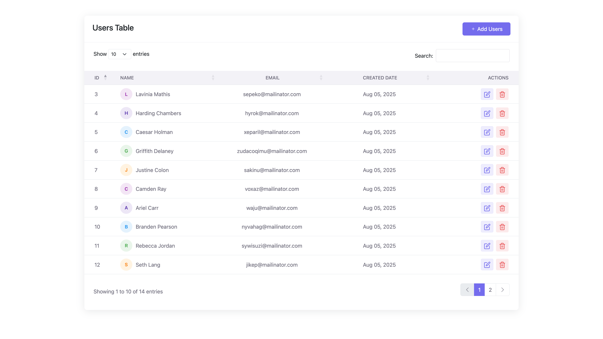
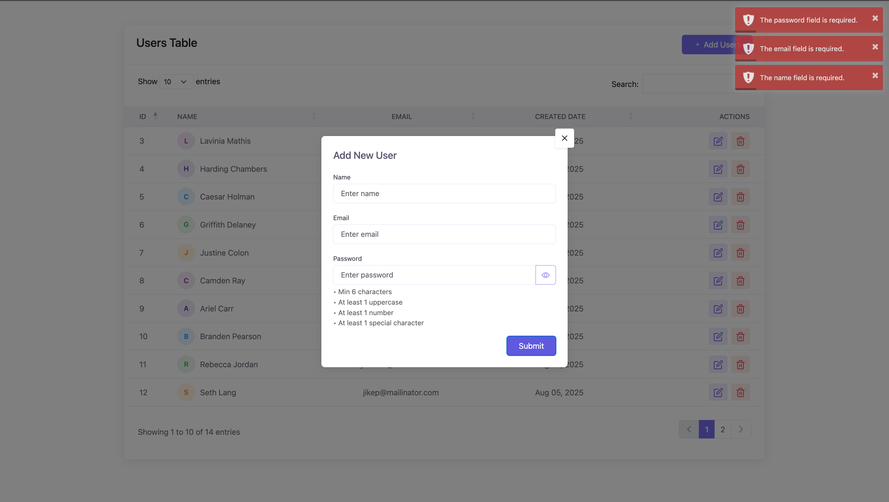
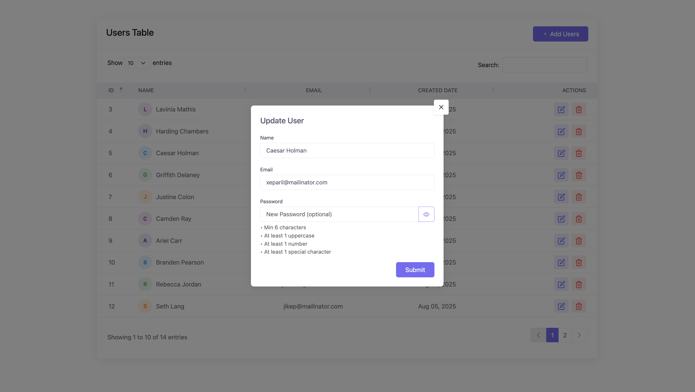
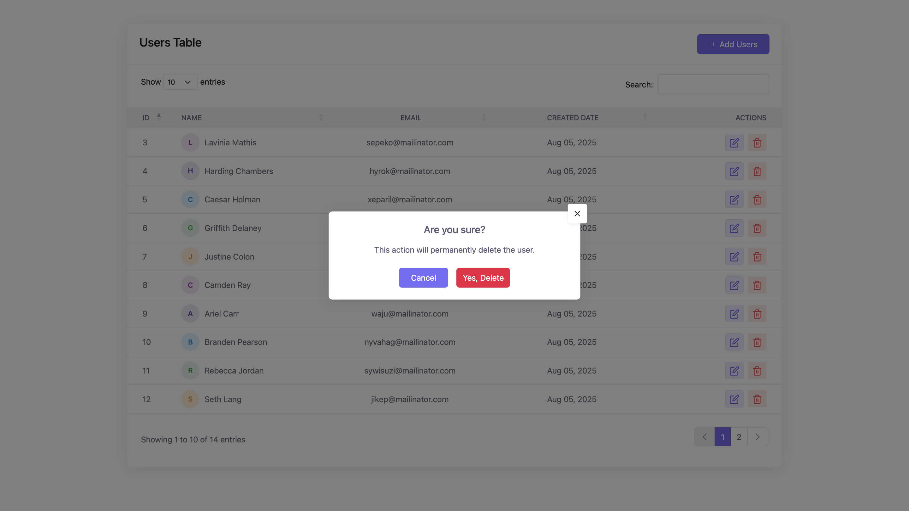

# 🧑‍💻 Laravel User Management (AJAX + Bootstrap Modals)

A modern, clean, and responsive **User Management CRUD** system built with Laravel, Bootstrap 5, and AJAX. Includes:

- Live user listing with DataTables
- Add & Update via Bootstrap Modals
- Password validation rules
- Delete with confirmation modal
- Toastr notifications
- JSON API-driven backend

---

## 🚀 Tech Stack

- **Laravel 10**
- **Bootstrap 5**
- **jQuery + AJAX**
- **DataTables**
- **Toastr**
- **MySQL** (or any Laravel-supported DB)

---

## 📦 Features

- ✅ Fully RESTful CRUD (using resource controller)
- ✅ Clean UX with modals for Add/Edit/Delete
- ✅ Password rules: min 6 chars, 1 uppercase, 1 number, 1 special char
- ✅ Proper validation via Form Requests
- ✅ Server-side error display (Toastr)
- ✅ Responsive and mobile-friendly UI
- ✅ JSON response structure

---

## 📁 Folder Structure

```
├── app
│   ├── Http
│   │   ├── Controllers
│   │   │   └── UserController.php
│   │   └── Requests
│   │       ├── StoreUserRequest.php
│   │       └── UpdateUserRequest.php
├── resources
│   └── views
│       ├── layout.blade.php
│       └── users
│           ├── index.blade.php
│           └── partials
│               └── modals.blade.php
├── routes
│   └── web.php
└── public
    └── screenshots
        ├── user-list.png
        ├── add-user.png
        ├── edit-user.png
        └── delete-user.png
```

---

## 🛠️ Setup Instructions

1. Clone the repository:
    ```bash
    git clone https://github.com/your-repo/user-management-crud.git
    ```

2. Navigate into the project:
    ```bash
    cd user-management-crud
    ```

3. Install dependencies:
    ```bash
    composer install
    npm install && npm run dev
    ```

4. Configure `.env`:
    ```bash
    cp .env.example .env
    php artisan key:generate
    ```

5. Set DB credentials and run migrations:
    ```bash
    php artisan migrate
    ```

6. Start local server:
    ```bash
    php artisan serve
    ```

7. Visit `http://127.0.0.1:8000/users`

---

## 🖼️ Screenshots

### 🧑 User List


### ➕ Add User Modal


### ✏️ Edit User Modal


### 🗑️ Delete Confirmation


---

## 🔒 Password Rules

- Minimum 6 characters  
- At least 1 uppercase letter  
- At least 1 numeric digit  
- At least 1 special character (`@, #, $, %, etc`)

**Example:** `Hello@123`

---

## 🔄 API Responses

All requests return JSON with success/error structure:
```json
{
  "status": true,
  "message": "User created successfully."
}
```

Validation errors return:
```json
{
  "errors": {
    "email": ["The email field must be a valid email address."]
  }
}
```

---

## 🙌 Contributions

Feel free to fork and improve this project. PRs are welcome. Please follow PSR-12 and Laravel best practices.

---

## 👨‍💻 Author

**Senior Laravel Developer — Muhammad Numan**  
Crafted with performance, maintainability, and clean UX in mind.

---

## 📝 License

MIT — Free to use and modify.
